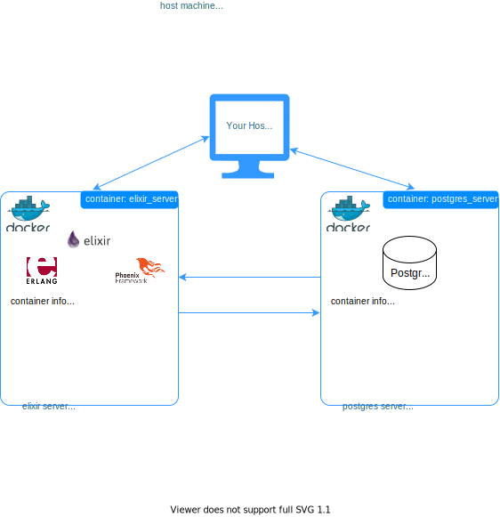

# elixirdock

## Why you should use it
- Have you ever faced problems setting up an **Elixir-Phoenix-Postgres** development environment?

- Do you think installing **Postgres** in your development system is a tricky business?

- Worried about overloading your system with tons of dependencies and apps, making it slower, less productive?

- Needing a specific version for **Elixir**, **Phoenix** and/or **Postgres** to run your tests and development smoothly?

- Studying an outdated course (ie. [Udemy's The Complete Elixir and Phoenix Bootcamp](https://www.udemy.com/course/the-complete-elixir-and-phoenix-bootcamp-and-tutorial/)) and your exercises are no longer working?

You're not alone! This repo uses containers to set your mind free from dependency problems for this stack.

## How it works

<p align="center">
  
</p>

## Setup instructions

1. Make sure you have `make`, `git`, `docker`, and `docker-compose` installed in your system. If you don't, please follow the instructions provided bellow:

    ### Installing **make**

    ##### |*Debian/Ubuntu users*|
    ```bash
    sudo apt install make
    ```

    ##### |*Mac users*|
    ```bash
    $ brew install make
    ```
    ##### |*Windows users*|

    [http://gnuwin32.sourceforge.net/packages/make.htm](http://gnuwin32.sourceforge.net/packages/make.htm)

    ### Installing **git**

    ##### |*All users*|

    [https://git-scm.com/downloads](https://git-scm.com/downloads)

    ### Installing **docker**

    ##### |*All users*|

    [https://docs.docker.com/get-docker/](https://docs.docker.com/get-docker/)

    ### Installing **docker-compose**

    ##### |*All users*|

    [https://docs.docker.com/compose/install/](https://docs.docker.com/compose/install/)


2. Clone this repository using `git clone` to your development directory and set it as the current directory:

    ```bash
    /your/path$ git clone https://github.com/rocharv/elixirdock.git
    /your/path$ cd elixirdock
    /your/path/elixirdock$
    ```

3. Edit the provided  `.env` file to customize your versions. The default is set to work with [Udemy's The Complete Elixir and Phoenix Bootcamp](https://www.udemy.com/course/the-complete-elixir-and-phoenix-bootcamp-and-tutorial/) as shown bellow:
    ```bash
    /your/path/elixirdock$ cat .env
    # ---------------------------------------------------------
    # Erlang version (base container)
    # ---------------------------------------------------------
    # Check all valid tags at:
    # https://hub.docker.com/_/erlang?tab=tags
    #
    # examples: 19, 20, 21, 22, 23, slim, latest ...
    # ---------------------------------------------------------
    ERLANG_VERSION=21-slim

    # Container ports (host:container)
    ERLANG_CONTAINER_PORTS=4000:4000

    # ---------------------------------------------------------
    # Elixir version
    # ---------------------------------------------------------
    # Check all valid releases at:
    # https://github.com/elixir-lang/elixir/releases
    #
    # examples: 1.6.6, 1.11.2, ...
    # ---------------------------------------------------------
    ELIXIR_VERSION=1.6.6

    # ---------------------------------------------------------
    # Phoenix version
    # ---------------------------------------------------------
    # Check all valid releases at:
    # https://github.com/phoenixframework/phoenix/releases
    #
    # examples: 1.2.5, 1.5.6, ...
    # ---------------------------------------------------------
    PHOENIX_VERSION=1.2.5

    # ---------------------------------------------------------
    # Postgres version
    # ---------------------------------------------------------
    # Check all valid tags at:
    # https://hub.docker.com/_/postgres?tab=tags
    #
    # examples: 9, 9.5, 10, 11, 12, 13, latest, ...
    # ---------------------------------------------------------
    POSTGRES_VERSION=9.5

    #Container ports (host:container)
    POSTGRES_CONTAINER_PORTS=5432:5432

    # Default user and his password
    POSTGRES_USER=postgres
    POSTGRES_PASSWORD=postgres

    ```
    >Note: Check out the **Reference** section to get help choosing versions that work one another.
4. Build your containers using `make` to gain productivity.
    ```bash
    /your/path/elixirdock$ make setup
    ```
5. You are **all set**! Now you can access the terminal of `elixir_server` container and run your apps:
    ```bash
    /your/path/elixirdock$ make open
    Makefile: Opening container interactive pseudo tty...
    root@9eaa60f11a17:/var/www$ iex
    Erlang/OTP 21 [erts-10.3.5.14] [source] [64-bit] [smp:16:16] [ds:16:16:10] [async-threads:1] [hipe]

    Interactive Elixir (1.6.6) - press Ctrl+C to exit (type h() ENTER for help)
    iex(1)>
    ```

6. There are other tools in `Makefile` to help you manage the container, for instance:
    ```bash
    /your/path/elixirdock$ make shutdown
    Makefile: Stopping and removing containers...
    Stopping postgres_server ... done
    Stopping elixir_server   ... done
    Removing postgres_server ... done
    Removing elixir_server   ... done
    ```
    You can see all tools in `Makefile` by typing just `make`:
    ```bash
    /your/path/elixirdock$ make
    open                           Open elixir container interactive pseudo tty
    setup-recreate                 Recreate and start elixir and postgres containers
    setup                          Set up elixir and postgres containers
    shutdown                       Shut down elixir and postgres containers
    ```

## Reference: choosing versions

### Postgres
1. Versions that work with **Elixir** and **Phoenix**:

    You can choose almost any Postgres version you like. Just as a reminder, Phoenix uses `postgrex` Elixir lib to work.
    So please feel free to choose among one of these versions for your Elixir apps:

    POSTGRES VERSIONS | COMMENT
    -|-
    8.4, 9.0-9.6 or later | **hstore** is not supported on 8.4

>Source: https://github.com/elixir-ecto/postgrex

2. Under the hood, **elixirdoc** creates a container called `postgres_server`. This container is based on `postgres` docker image, thus the `POSTGRES_VERSION` in `.env` file should be a valid tag of this [docker image](https://hub.docker.com/_/erlang).


### Erlang and Elixir versions

1. **Erlang** and **Elixir** compatible versions:

    ELIXIR VERSION | SUPPORTED ERLANG/OTP VERSIONS
    -|-
    1.0 | 17 - 17 (and Erlang/OTP 18 from v1.0.5)
    1.1	| 17 - 18
    1.2	| 18 - 18 (and Erlang/OTP 19 from v1.2.6)
    1.3	| 18 - 19
    1.4	| 18 - 19 (and Erlang/OTP 20 from v1.4.5)
    1.5	| 18 - 20
    1.6	| 19 - 20 (and Erlang/OTP 21 from v1.6.6)
    1.7	| 19 - 22
    1.8	| 20 - 22
    1.9	| 20 - 22
    1.10 | 21 - 22 (and Erlang/OTP 23 from v1.10.3)
    1.11 | 21 - 23

    >Source: https://hexdocs.pm/elixir/compatibility-and-deprecations.html#compatibility-between-elixir-and-erlang-otp

2. Under the hood, **elixirdoc** creates a container called `elixir_server`. This container is based on `erlang` docker image, thus the `ERLANG_VERSION` in `.env` file should be a valid tag of this [docker image](https://hub.docker.com/_/postgres).

### Phoenix
Choose a valid release version listed as a tag on the **github** page of **Phoenix**:
https://github.com/phoenixframework/phoenix/releases

If you run into problems, consider choosing an appropriate version of **Elixir**/**Erlang** for each specific version of **Phoenix**.